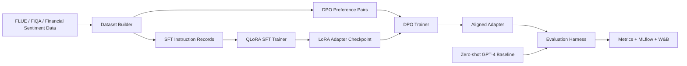

# LLM Fine-Tuning with QLoRA + DPO

[](https://www.python.org/)
[](https://pytorch.org/)
[](https://huggingface.co/docs/transformers)
[](https://arxiv.org/abs/2305.14314)
[](https://arxiv.org/abs/2305.18290)
[](https://mlflow.org/)
[](https://wandb.ai/)

Reproducible fine-tuning project for financial sentiment classification using QLoRA supervised fine-tuning, DPO preference optimization, and evaluation against zero-shot GPT-4-style baselines.


## What It Builds

- Fine-tunes `meta-llama/Meta-Llama-3-8B-Instruct` and `Qwen/Qwen2.5-7B-Instruct` on financial sentiment prompts.
- Includes an optional Mistral 7B config for portfolio comparison runs.
- Uses QLoRA with 4-bit NF4 quantization and rank-16 LoRA adapters by default.
- Runs ablations across models, learning rates, LoRA ranks, seeds, and training-data mixtures.
- Applies DPO post-training using preference pairs generated from financial sentiment labels.
- Tracks 50+ experiment configurations with MLflow and optional Weights & Biases logging.
- Evaluates accuracy, macro-F1, calibration error, invalid-label rate, hallucination proxy rate, latency, and baseline lift.
- Includes a technical writeup that can become a Medium/blog post.

## Architecture



## Demo


Run a CPU-safe smoke evaluation without downloading 7B/8B models:

```bash
python3 scripts/run_smoke_eval.py --predictions data/samples/predictions_sample.jsonl
```

Generate the 50+ run ablation manifest:

```bash
python3 scripts/generate_ablation_manifest.py --output artifacts/ablation_manifest.csv
```

## Setup

```bash
python3 -m venv .venv
source .venv/bin/activate
pip install -r requirements.txt
cp .env.example .env
```

For gated Llama models, authenticate with Hugging Face:

```bash
huggingface-cli login
```

Optional tracking:

```bash
wandb login
export MLFLOW_TRACKING_URI=./mlruns
```

## GPU Training

Recommended free/low-cost path:

- Kaggle GPU: good for Qwen2.5-7B or shorter Llama runs.
- Colab Pro T4/A100: better for longer rank and data-mixture sweeps.
- Minimum practical VRAM: 16 GB with 4-bit QLoRA, gradient checkpointing, and small batches.

Run QLoRA SFT:

```bash
accelerate launch scripts/train_sft.py --config configs/experiments/llama3_8b_qlora_rank16.yaml
accelerate launch scripts/train_sft.py --config configs/experiments/qwen25_7b_qlora_rank16.yaml
```

Run DPO:

```bash
accelerate launch scripts/train_dpo.py --config configs/experiments/llama3_8b_dpo.yaml
accelerate launch scripts/train_dpo.py --config configs/experiments/qwen25_7b_dpo.yaml
```

Evaluate:

```bash
python3 scripts/evaluate_model.py --config configs/experiments/eval_financial_sentiment.yaml
```

## Results (real run)

Fine-tuned `Qwen/Qwen2.5-0.5B-Instruct` with QLoRA (4-bit NF4, LoRA rank-16) on
Financial PhraseBank — ~2,000 train / 970 held-out test examples — on a single
free Colab T4 GPU. Reproduce with [`notebooks/colab_quickstart.ipynb`](notebooks/colab_quickstart.ipynb).

| Metric | Fine-tuned (QLoRA SFT) | Base model, zero-shot |
| --- | ---: | ---: |
| Accuracy (970 held-out) | **80.8%** | 25.4% |
| Macro-F1 | 0.80 | — |
| Expected calibration error | 0.044 | — |
| Invalid-output rate | 0.3% | — |
| Mean latency / example | 336 ms | — |

Fine-tuning lifted held-out accuracy from 25% (zero-shot) to 81% and drove the
invalid-output rate to 0.3% — the model learned both the task and clean label
formatting. Main error mode is neutral↔positive confusion (see
[`docs/results.md`](docs/results.md) for the full confusion matrix). The base
zero-shot score is low because a 0.5B base model does not follow the label
format without tuning.

The QLoRA/DPO method here is identical for the larger `configs/experiments/`
models (Qwen2.5-7B, Llama 3 8B); only model size and GPU requirements change.

### Engineering surface

| Capability | Status |
| --- | --- |
| Metrics implemented (accuracy, macro-F1, ECE, Brier, invalid-rate, hallucination proxy, latency, lift) | 8, see `docs/evaluation_plan.md` |
| Ablation grid generator | 72-run grid via `scripts/generate_ablation_manifest.py` (config-generated; logged via MLflow `report_to` when the sweep runs on GPU) |
| SFT / DPO / predict / eval / baseline scripts | `scripts/` |
| QLoRA adapters | rank-16 default, configs for 0.5B / 7B / 8B |

## Serving (inference API)

The fine-tuned model is served behind a FastAPI endpoint — the deployment stage
of the lifecycle. Two backends, one contract:

```bash
# Local free demo (no GPU, no adapter): base model via Ollama
ollama pull qwen2.5:0.5b
MODEL_BACKEND=ollama uvicorn qlora_dpo_finance.api:app --port 8000

# Serve the actual fine-tuned model: download the adapter from the Colab run
# (notebook step 11 -> qlora_adapter.zip), unzip to outputs/qwen25_0_5b_qlora_rank16
MODEL_BACKEND=transformers ADAPTER_PATH=outputs/qwen25_0_5b_qlora_rank16 \
  uvicorn qlora_dpo_finance.api:app --port 8000

curl -X POST localhost:8000/predict -H 'Content-Type: application/json' \
  -d '{"text": "The company reported record profits and raised guidance."}'
# -> {"label": "positive", "confidence": ..., "latency_ms": ..., "backend": ...}
```

`GET /health`, `POST /predict`, `POST /predict/batch`. Tests run against a mock
backend (no Ollama/model needed in CI).

## Lifecycle coverage

| Stage | Status |
| --- | --- |
| Data (prep + held-out split) | ✅ `scripts/prepare_financial_phrasebank.py` |
| Training (QLoRA SFT + DPO) | ✅ reproducible configs, 0.5B/7B/8B |
| Evaluation (accuracy/F1/ECE + baseline) | ✅ real run, 80.8% vs 25.4% |
| Experiment tracking | ✅ MLflow via `report_to`; sweep grid generated from config |
| Packaging | ✅ LoRA adapter save/load |
| Serving (REST inference) | ✅ FastAPI, dual backend |
| Containerization | ✅ Dockerfile |
| CI + tests | ✅ 10 tests, offline |
| Deployment / monitoring | ⬜ next: cloud deploy + prediction-drift logging |

## Datasets And Models

- FLUE / FiQA financial sentiment and QA benchmark: https://huggingface.co/datasets/SALT-NLP/FLUE-FiQA
- Open FinLLM Leaderboard context: https://finllm-leaderboard.readthedocs.io/en/latest/overview/introduction.html
- Llama 3 8B Instruct model card: https://huggingface.co/meta-llama/Meta-Llama-3-8B-Instruct
- Qwen2.5 7B Instruct model card: https://huggingface.co/Qwen/Qwen2.5-7B-Instruct
- Mistral 7B Instruct model card: https://huggingface.co/mistralai/Mistral-7B-Instruct-v0.3

## Repository Layout

```text
.github/workflows/       GitHub Actions smoke checks
configs/experiments/     model, SFT, DPO, and evaluation configs
configs/sweeps/          ablation grid for 50+ tracked runs
data/samples/            tiny local fixtures for tests and smoke eval
docs/                    architecture, evaluation plan, blog draft, demo visual
scripts/                 SFT, DPO, evaluation, baseline, ablation CLIs
src/qlora_dpo_finance/   data, metrics, config, trainer helpers
tests/                   local tests that do not require a GPU
```

## Notes

This is a training and evaluation framework, not investment advice. The smoke fixtures are intentionally small; real metrics should be reported after GPU training with the documented configs.
