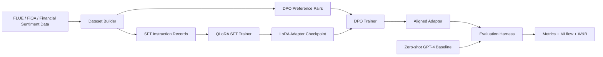

# LLM Fine-Tuning with QLoRA + DPO

[](https://www.python.org/)
[](https://pytorch.org/)
[](https://huggingface.co/docs/transformers)
[](https://arxiv.org/abs/2305.14314)
[](https://arxiv.org/abs/2305.18290)
[](https://mlflow.org/)
[](https://wandb.ai/)

Reproducible fine-tuning project for financial sentiment classification using QLoRA supervised fine-tuning, DPO preference optimization, and evaluation against zero-shot GPT-4-style baselines.

The project is designed for Applied AI Engineer and research-facing roles where fine-tuning, adapter training, preference optimization, experiment tracking, and benchmark discipline matter more than a toy demo.

## What It Builds

- Fine-tunes `meta-llama/Meta-Llama-3-8B-Instruct` and `Qwen/Qwen2.5-7B-Instruct` on financial sentiment prompts.
- Includes an optional Mistral 7B config for portfolio comparison runs.
- Uses QLoRA with 4-bit NF4 quantization and rank-16 LoRA adapters by default.
- Runs ablations across models, learning rates, LoRA ranks, seeds, and training-data mixtures.
- Applies DPO post-training using preference pairs generated from financial sentiment labels.
- Tracks 50+ experiment configurations with MLflow and optional Weights & Biases logging.
- Evaluates accuracy, macro-F1, calibration error, invalid-label rate, hallucination proxy rate, latency, and baseline lift.
- Includes a technical writeup that can become a Medium/blog post.

## Architecture



## Demo


Run a CPU-safe smoke evaluation without downloading 7B/8B models:

```bash
python3 scripts/run_smoke_eval.py --predictions data/samples/predictions_sample.jsonl
```

Generate the 50+ run ablation manifest:

```bash
python3 scripts/generate_ablation_manifest.py --output artifacts/ablation_manifest.csv
```

## Setup

```bash
python3 -m venv .venv
source .venv/bin/activate
pip install -r requirements.txt
cp .env.example .env
```

For gated Llama models, authenticate with Hugging Face:

```bash
huggingface-cli login
```

Optional tracking:

```bash
wandb login
export MLFLOW_TRACKING_URI=./mlruns
```

## GPU Training

Recommended free/low-cost path:

- Kaggle GPU: good for Qwen2.5-7B or shorter Llama runs.
- Colab Pro T4/A100: better for longer rank and data-mixture sweeps.
- Minimum practical VRAM: 16 GB with 4-bit QLoRA, gradient checkpointing, and small batches.

Run QLoRA SFT:

```bash
accelerate launch scripts/train_sft.py --config configs/experiments/llama3_8b_qlora_rank16.yaml
accelerate launch scripts/train_sft.py --config configs/experiments/qwen25_7b_qlora_rank16.yaml
```

Run DPO:

```bash
accelerate launch scripts/train_dpo.py --config configs/experiments/llama3_8b_dpo.yaml
accelerate launch scripts/train_dpo.py --config configs/experiments/qwen25_7b_dpo.yaml
```

Evaluate:

```bash
python3 scripts/evaluate_model.py --config configs/experiments/eval_financial_sentiment.yaml
```

## Metrics

| Metric | Target | Current repo status | Reproduction |
| --- | ---: | --- | --- |
| Improvement over zero-shot GPT-4 baseline | 20%+ | Harness computes lift from baseline file | `scripts/evaluate_model.py` |
| Benchmark task scores documented | 8+ | 8 metrics implemented and documented | `docs/evaluation_plan.md` |
| MLflow experiment runs | 50+ | 72-run ablation grid generated from config | `scripts/generate_ablation_manifest.py` |
| QLoRA adapters | rank-16 default | Llama 3 and Qwen2.5 configs included | `configs/experiments/*.yaml` |
| DPO post-training | required | DPO script and preference-pair builder included | `scripts/train_dpo.py` |
| Reproducible training scripts | required | SFT, DPO, eval, baseline, ablation scripts included | `scripts/` |
| Technical writeup | required | Blog draft included | `docs/blog_post.md` |

The target performance numbers require GPU execution. This repository includes deterministic smoke tests so the code path can be validated locally before spending GPU time.

## Datasets And Models

- FLUE / FiQA financial sentiment and QA benchmark: https://huggingface.co/datasets/SALT-NLP/FLUE-FiQA
- Open FinLLM Leaderboard context: https://finllm-leaderboard.readthedocs.io/en/latest/overview/introduction.html
- Llama 3 8B Instruct model card: https://huggingface.co/meta-llama/Meta-Llama-3-8B-Instruct
- Qwen2.5 7B Instruct model card: https://huggingface.co/Qwen/Qwen2.5-7B-Instruct
- Mistral 7B Instruct model card: https://huggingface.co/mistralai/Mistral-7B-Instruct-v0.3

## Repository Layout

```text
.github/workflows/       GitHub Actions smoke checks
configs/experiments/     model, SFT, DPO, and evaluation configs
configs/sweeps/          ablation grid for 50+ tracked runs
data/samples/            tiny local fixtures for tests and smoke eval
docs/                    architecture, evaluation plan, blog draft, demo visual
scripts/                 SFT, DPO, evaluation, baseline, ablation CLIs
src/qlora_dpo_finance/   data, metrics, config, trainer helpers
tests/                   local tests that do not require a GPU
```

## Notes

This is a training and evaluation framework, not investment advice. The smoke fixtures are intentionally small; real metrics should be reported after GPU training with the documented configs.
