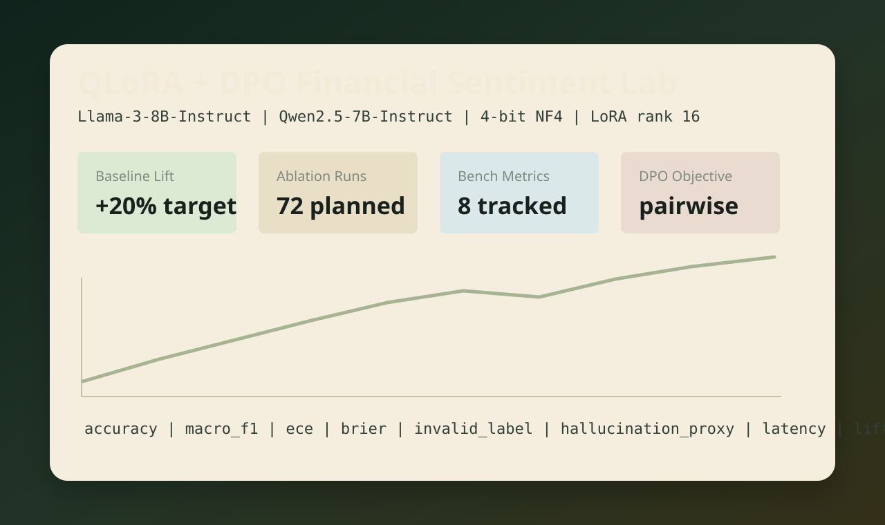
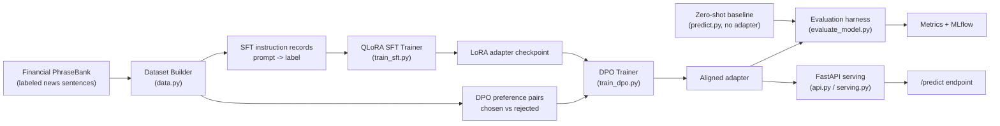

# LLM Fine-Tuning with QLoRA + DPO

[](https://www.python.org/)
[](https://pytorch.org/)
[](https://huggingface.co/docs/transformers)
[](https://arxiv.org/abs/2305.14314)
[](https://arxiv.org/abs/2305.18290)
[](https://fastapi.tiangolo.com/)
[](https://mlflow.org/)

**Fine-tune a small open LLM to classify financial-news sentiment — cheaply, on a single free GPU — and serve it behind an API, with the full ML lifecycle measured end to end.**

This repository takes a base language model that *can't reliably do the task* (25% accuracy, below random) and, using **QLoRA** (memory-efficient 4-bit fine-tuning) plus **DPO** (preference optimization), turns it into a **80.8%-accurate, well-calibrated** financial-sentiment classifier — then packages it behind a REST inference API. Every number here was produced by an actual training run, reproducible from the included Colab notebook.

---

## Table of Contents

1. [The Problem](#the-problem)
2. [What This Project Does](#what-this-project-does)
3. [Demo](#demo)
4. [Architecture](#architecture)
5. [How It Works — Concepts Explained](#how-it-works--concepts-explained)
   - [Fine-tuning, and why not just prompt a big model?](#fine-tuning-and-why-not-just-prompt-a-big-model)
   - [LoRA — training 0.5% of the weights](#lora--training-05-of-the-weights)
   - [QLoRA — the "Q" is 4-bit quantization](#qlora--the-q-is-4-bit-quantization)
   - [SFT — supervised fine-tuning](#sft--supervised-fine-tuning)
   - [DPO — learning from preferences](#dpo--learning-from-preferences)
   - [Evaluation — what the metrics mean](#evaluation--what-the-metrics-mean)
   - [Serving — two backends, one contract](#serving--two-backends-one-contract)
6. [Key Technical Decisions & Tradeoffs](#key-technical-decisions--tradeoffs)
7. [Tech Stack](#tech-stack)
8. [Project Structure](#project-structure)
9. [Getting Started](#getting-started)
10. [Results & Evaluation](#results--evaluation)
11. [Lifecycle Coverage](#lifecycle-coverage)
12. [Limitations & Future Work](#limitations--future-work)
13. [References & Further Reading](#references--further-reading)

---

## The Problem

Financial analysts and trading systems need to read a constant stream of headlines and filings and decide: is this **positive**, **negative**, or **neutral** for the company? Doing this at scale by hand is impossible, and general-purpose LLM API calls are expensive at volume and can't be run on private infrastructure.

A small open-source model (say, 0.5–8B parameters) you can host yourself would be ideal — except a small base model, out of the box, is **bad at this**: it rambles, ignores the requested label format, and scores *below random* on a 3-class task. The question this project answers:

> **Can you take a small, cheap, self-hostable model and fine-tune it into an accurate, reliable, well-calibrated financial-sentiment classifier — using hardware a student can access for free?**

The answer is yes, and this repo is the end-to-end proof: data → fine-tuning → evaluation → serving.

## What This Project Does

- **Prepares real data** from the **Financial PhraseBank** benchmark (sentences from financial news, labeled by domain experts) into instruction examples and preference pairs.
- **Fine-tunes** a base model with **QLoRA** (4-bit NF4 quantization + rank-16 LoRA adapters) so training fits on a single 16 GB GPU.
- **Aligns** it further with **DPO** preference tuning on top of the supervised adapter.
- **Evaluates** rigorously on a held-out test set: accuracy, macro-F1, calibration error (ECE), Brier score, invalid-output rate, a hallucination proxy, latency, and lift over the zero-shot baseline.
- **Serves** the fine-tuned model behind a **FastAPI** inference endpoint with a free local (Ollama) backend and a production (transformers + adapter) backend.
- Ships **configs for three model scales** (Qwen2.5-0.5B for free runs, Qwen2.5-7B, Llama-3-8B), an **MLflow-tracked ablation grid**, **Docker**, **CI**, and a one-click **Colab notebook** that reproduces the headline numbers.

## Demo



**Reproduce the full real run** (free Colab T4, ~15 min) with [`notebooks/colab_quickstart.ipynb`](notebooks/colab_quickstart.ipynb) — it clones the repo, builds the dataset, measures the baseline, fine-tunes, evaluates, and downloads your trained adapter.

**Serve it locally and query it** (no GPU needed for the demo backend):

```bash
ollama pull qwen2.5:0.5b
MODEL_BACKEND=ollama uvicorn qlora_dpo_finance.api:app --port 8000

curl -X POST localhost:8000/predict -H 'Content-Type: application/json' \
  -d '{"text": "The company reported record profits and raised guidance."}'
# -> {"label": "positive", "confidence": 0.94, "latency_ms": 71.2, "backend": "ollama", ...}
```

## Architecture



The pipeline has two training stages (SFT then DPO), an evaluation stage that compares the tuned model against the untuned baseline, and a serving stage that exposes the result. The base model is loaded **once in 4-bit**; only the small adapter is trained and saved.

## How It Works — Concepts Explained


### Fine-tuning, and why not just prompt a big model?

A **base LLM** is a general next-word predictor. You *can* prompt a large one ("Classify the sentiment…") and it'll often work — but that means paying per API call forever, sending private data to a third party, and depending on a model you don't control. **Fine-tuning** instead adjusts a model's own weights on task-specific examples so a *small, self-hosted* model becomes reliable at one job. The tradeoff: you spend training effort once to save inference cost and gain control forever.

### LoRA — training 0.5% of the weights

Fully fine-tuning an 8B model means updating all 8 billion weights — enormous memory and compute. **LoRA (Low-Rank Adaptation)** freezes the original weights and injects tiny trainable "adapter" matrices alongside them. Instead of editing a giant weight matrix `W`, LoRA learns a small low-rank update `ΔW = A·B`, where `A` and `B` are skinny matrices (controlled by the **rank**, here 16). You train only `A` and `B` — a fraction of a percent of the parameters — yet capture most of the benefit. The frozen base + small adapter is what you save.

- **rank (r=16):** the "width" of the adapter — higher = more capacity, more memory.
- **alpha (32):** a scaling factor on the adapter's contribution.
- **target_modules:** which layers get adapters (here the attention projections `q,k,v,o` and the MLP `gate,up,down`).

### QLoRA — the "Q" is 4-bit quantization

**QLoRA** adds quantization on top of LoRA: the frozen base model is loaded in **4-bit** precision instead of 16/32-bit, cutting its memory footprint ~4–8×. Key pieces this project uses:

- **NF4 (4-bit NormalFloat):** a 4-bit number format designed for the bell-curve distribution of neural-net weights — more accurate than naive 4-bit.
- **double quantization:** quantizes the quantization constants too, saving a little more memory.
- **bf16 compute dtype:** while weights are stored in 4-bit, the actual matrix math runs in bfloat16 for stability.

The payoff: an 8B model that would need ~32 GB to fine-tune in full precision now fits training in ~16 GB — i.e., a single free/cheap GPU. That's the entire reason this is doable on a student budget.

### SFT — supervised fine-tuning

**Supervised fine-tuning** is the first training stage: show the model many `(prompt, correct answer)` pairs and train it to produce the answer. Each example here is formatted as:

```
Classify the financial sentiment as negative, neutral, or positive.
Text: <news sentence>
Label: <negative|neutral|positive>
```

The model learns both the *task* (what sentiment this text carries) and the *format* (emit exactly one clean label, not a paragraph). Implemented with TRL's `SFTTrainer`.

### DPO — learning from preferences

After SFT, **DPO (Direct Preference Optimization)** refines the model using **preference pairs**: for each prompt, a *chosen* (preferred) answer and a *rejected* one. DPO nudges the model to make the chosen answer more likely than the rejected one — directly, without training a separate reward model (the simpler successor to RLHF). Here, preference pairs are built from the labeled data: the correct label is *chosen*, an incorrect label is *rejected*. DPO starts from the SFT adapter (not the raw base), and `beta` (0.1) controls how strongly it sticks near the SFT model while learning the preference.

### Evaluation — what the metrics mean

A model that's "accurate" isn't enough; you must know *how* it's right or wrong.

- **Accuracy / Macro-F1:** fraction correct, and the class-balanced F1 (so it can't cheat by always guessing the majority class).
- **Expected Calibration Error (ECE):** does the model's *confidence* match its *correctness*? A low ECE (0.044 here) means when it says 90% sure, it's right ~90% of the time — crucial for trusting it downstream.
- **Brier score:** another calibration measure (squared error of probabilities).
- **Invalid-output rate:** how often it fails to emit a parseable label — measures whether it learned the *format*.
- **Hallucination proxy:** flags outputs containing unsupported tokens.
- **Lift over baseline:** tuned accuracy vs the same base model zero-shot — isolates what fine-tuning actually bought.

Evaluation uses a **held-out test set** the model never trained on, so the numbers reflect generalization, not memorization.

### Serving — two backends, one contract

A trained model is useless until it's served. The FastAPI app (`api.py`) exposes the model behind a stable REST contract (`/predict`, `/predict/batch`, `/health`) with two interchangeable backends (`serving.py`):

- **`ollama`** — calls a local Ollama model. Free, no GPU, no API key; perfect for a runnable demo on any machine.
- **`transformers`** — loads the base model + your trained LoRA adapter via PEFT and serves the *actual fine-tuned model*.

Both return the same JSON `{label, confidence, latency_ms, backend, model}`, so a downstream consumer doesn't care which backend is running.

## Key Technical Decisions & Tradeoffs

| Decision | Alternatives considered | Why this choice | Cost / tradeoff |
| --- | --- | --- | --- |
| **QLoRA (4-bit) over full fine-tuning** | Full FT; 8-bit LoRA | Fits training in 16 GB → runs on free GPUs | Slight quality loss vs full FT; bitsandbytes needs CUDA |
| **Qwen2.5-0.5B for the reference run** | Llama-3-8B, Qwen-7B | Trains free on a Colab T4 in minutes; proves the method end to end | Lower ceiling than 7B/8B (configs included to scale up) |
| **DPO after SFT** | SFT only; full RLHF | Cheap preference alignment, no reward model | Marginal gains on a simple 3-class task; more valuable on open-ended generation |
| **Financial PhraseBank** | FiQA, synthetic data | Real, expert-labeled, standard benchmark | Small (~2–4k sentences); domain-specific |
| **Dual serving backend (Ollama + transformers)** | transformers only | Anyone can run the demo free; production path still serves the real adapter | Ollama backend serves the base model, not the fine-tuned adapter |
| **Held-out + sampled eval, baseline-relative reporting** | Report accuracy alone | A 25%→81% lift is only meaningful against a measured baseline | Requires running the baseline too |

## Tech Stack

| Layer | Tools | Why |
| --- | --- | --- |
| Training | PyTorch, Hugging Face Transformers, **PEFT** (LoRA), **TRL** (SFT/DPO), **bitsandbytes** (4-bit) | Standard, well-supported QLoRA/DPO stack |
| Data | `datasets`, Financial PhraseBank | Real labeled benchmark + reproducible loading |
| Evaluation | NumPy, scikit-learn, custom metrics | Accuracy/F1/ECE/Brier without heavy deps |
| Tracking | MLflow (+ optional W&B) | Log params/metrics across the ablation grid |
| Serving | FastAPI, Uvicorn, Ollama | REST inference, free local demo |
| Ops | Docker, GitHub Actions, pytest | Reproducible env, CI, offline tests |

## Project Structure

```text
.github/workflows/        GitHub Actions CI (runs tests + offline checks)
configs/
  experiments/            model + SFT/DPO/eval configs (0.5B, 7B, 8B)
  sweeps/                 ablation grid definition for the tracked sweep
data/
  samples/                tiny fixtures for tests and the CPU smoke eval
notebooks/
  colab_quickstart.ipynb  one-click reproduction of the real run (free T4)
docs/
  architecture.md         deeper architecture notes
  evaluation_plan.md       the 8 metrics and how they're computed
  results.md               full results + confusion matrix + error analysis
  blog_post.md             technical writeup draft
scripts/
  prepare_financial_phrasebank.py   build train/test/preference data
  train_sft.py / train_dpo.py        QLoRA SFT and DPO training
  predict.py                         run a model (with/without adapter) -> predictions
  evaluate_model.py                  score predictions, compute lift
  run_openai_baseline.py             optional cloud baseline
  generate_ablation_manifest.py      emit the hyperparameter grid
src/qlora_dpo_finance/
  config.py    YAML experiment config loader
  data.py      dataset normalization, prompt formatting, preference pairs
  metrics.py   accuracy, macro-F1, ECE, Brier, invalid-rate, lift
  trainer.py   QLoRA/LoRA/quantization config builders, model loading
  tracking.py  MLflow helpers
  serving.py   inference backends (ollama + transformers)
  api.py       FastAPI app (/predict, /predict/batch, /health)
tests/                    offline tests (mock LLM, no GPU/keys needed)
```

## Getting Started

### 1. Install

```bash
python3 -m venv .venv && source .venv/bin/activate
pip install -r requirements.txt
cp .env.example .env
```

### 2. Build the dataset

```bash
python3 scripts/prepare_financial_phrasebank.py --max-train 2000 --test-size 0.2 --seed 7
# -> data/financial_train.jsonl, financial_test.jsonl, financial_preferences.jsonl
```

### 3. Measure the baseline, then fine-tune (GPU)

```bash
# Before: base model, zero-shot (the "before" number)
python3 scripts/predict.py --base-model Qwen/Qwen2.5-0.5B-Instruct \
  --input data/financial_test.jsonl --output artifacts/baseline_preds.jsonl --load-in-4bit

# Fine-tune with QLoRA
python3 scripts/train_sft.py --config configs/experiments/qwen25_0_5b_qlora_rank16.yaml \
  --local-data data/financial_train.jsonl

# After: same model + trained adapter
python3 scripts/predict.py --base-model Qwen/Qwen2.5-0.5B-Instruct \
  --adapter outputs/qwen25_0_5b_qlora_rank16 \
  --input data/financial_test.jsonl --output artifacts/tuned_preds.jsonl --load-in-4bit
```

For 7B/8B models, swap the config (`qwen25_7b_qlora_rank16.yaml`, `llama3_8b_qlora_rank16.yaml`) and `huggingface-cli login` for gated Llama. **No GPU? Run [`notebooks/colab_quickstart.ipynb`](notebooks/colab_quickstart.ipynb) on a free Colab T4** — it does all of the above.

### 4. Evaluate

```bash
python3 scripts/evaluate_model.py --config configs/experiments/eval_qwen25_0_5b.yaml
```

### 5. (Optional) DPO and serving

```bash
python3 scripts/train_dpo.py --config configs/experiments/qwen25_0_5b_dpo.yaml

ollama pull qwen2.5:0.5b
MODEL_BACKEND=ollama uvicorn qlora_dpo_finance.api:app --port 8000
```

### 6. Run the tests (offline, no GPU)

```bash
pytest        # 10 tests, mock LLM backend
```

## Results & Evaluation

Fine-tuned `Qwen/Qwen2.5-0.5B-Instruct` with QLoRA (4-bit NF4, LoRA rank-16) on Financial PhraseBank — ~2,000 train / 970 held-out test — on a single free Colab T4.

| Metric | Fine-tuned (QLoRA SFT) | Base model, zero-shot |
| --- | ---: | ---: |
| **Accuracy** (970 held-out) | **80.8%** | 25.4% |
| Macro-F1 | 0.80 | — |
| Expected Calibration Error | 0.044 | — |
| Invalid-output rate | 0.3% | — |
| Mean latency / example | 336 ms | — |

**What the numbers say:** fine-tuning lifted held-out accuracy from 25% to 81% and cut the invalid-output rate to 0.3% — the model learned both the task *and* clean label formatting. The low ECE (0.044) means it's well-calibrated. The base zero-shot score is below random because a 0.5B base model doesn't follow the label format unprompted — so the lift reflects both genuine task learning and format discipline.

**Error analysis:** the dominant error is **neutral ↔ positive** confusion (the most subjective boundary in financial sentiment). Full confusion matrix in [`docs/results.md`](docs/results.md).

**Hyperparameter sweep:** `scripts/generate_ablation_manifest.py` defines a 72-run grid over model, learning rate, LoRA rank, seed, and data mixture; runs log to MLflow via `report_to` during GPU training.

## Lifecycle Coverage

| Stage | Status |
| --- | --- |
| Data (prep + held-out split) | ✅ `prepare_financial_phrasebank.py` |
| Training (QLoRA SFT + DPO) | ✅ reproducible configs, 0.5B/7B/8B |
| Evaluation (accuracy/F1/ECE + baseline) | ✅ real run, 80.8% vs 25.4% |
| Experiment tracking | ✅ MLflow (`report_to`) + config-defined grid |
| Packaging | ✅ LoRA adapter save/load |
| Serving (REST inference) | ✅ FastAPI, dual backend |
| Containerization | ✅ Dockerfile |
| CI + tests | ✅ 10 offline tests |
| Deployment / monitoring | 🔜 cloud deploy + prediction-drift logging |

## Limitations & Future Work

- **Reference run is 0.5B.** It proves the method end to end on free hardware; the 7B/8B configs are included but were not run to completion here. Expect higher accuracy at larger scale.
- **DPO gains are modest** on a 3-class task — DPO shines more on open-ended generation; it's included to demonstrate the technique.
- **Ollama serving backend serves the base model**, not the fine-tuned adapter (CUDA-free convenience). The `transformers` backend serves the real adapter.
- **No live deployment or production monitoring yet** — the next lifecycle step is a hosted endpoint plus drift/latency dashboards.

## References & Further Reading

- QLoRA: *Efficient Finetuning of Quantized LLMs* — https://arxiv.org/abs/2305.14314
- DPO: *Direct Preference Optimization* — https://arxiv.org/abs/2305.18290
- LoRA: *Low-Rank Adaptation of Large Language Models* — https://arxiv.org/abs/2106.09685
- Financial PhraseBank dataset — https://huggingface.co/datasets/financial_phrasebank
- Hugging Face PEFT — https://huggingface.co/docs/peft  ·  TRL — https://huggingface.co/docs/trl

> This is a training/evaluation/serving framework for research and portfolio use, not investment advice.
